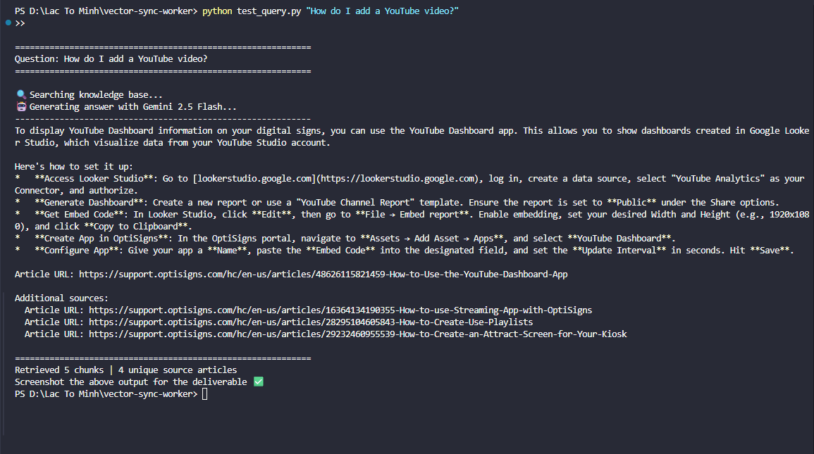

# vector-sync-worker

A daily RAG sync job that scrapes OptiSigns support articles, converts them to Markdown,
and indexes only changed articles into a local ChromaDB vector store powered by
**Google Gemini embeddings** (100% free).

---

## Setup

```bash
git clone <repo-url>
cd vector-sync-worker

python -m venv .venv && source .venv/bin/activate   # Linux/macOS
# python -m venv .venv && .venv\Scripts\activate    # Windows

pip install -r requirements.txt

cp .env.sample .env
# Edit .env — set GEMINI_API_KEY (free at https://aistudio.google.com/apikey)
```

---

## Run locally

```bash
# Full sync: scrape → diff → embed → index
python main.py

# Demo query (take screenshot of output for deliverable)
python test_query.py "How do I add a YouTube video?"
```

**First run** — scrapes ≥ 30 articles, embeds all, exits 0.  
**Subsequent runs** — only re-embeds changed articles (delta detection via SHA-256).

```
✅  Scraped: 100 | Added: 100 | Updated: 0 | Skipped: 0 | Chunks: 312 | Duration: 94s
```

---

## Run with Docker

\`\`\`bash
docker build -t optibot .

docker run --env-file .env \
  -e CHROMA_DIR=/app/data/chroma_db \
  -e STATE_FILE=/app/data/state.json \
  -v $(pwd)/data:/app/data \
  optibot
\`\`\`

---

## Daily job deployment (Railway / Render)

1. Push repo to GitHub (repo name must **not** contain "optisigns").
2. Create a **Cron Job** service on [Railway](https://railway.app) or [Render](https://render.com).
3. Schedule: `0 2 * * *` (02:00 UTC daily).
4. Set `GEMINI_API_KEY` as environment variable.
5. Set environment variables: `CHROMA_DIR=/data/chroma_db`, `STATE_FILE=/data/state.json`.
6. Mount a persistent volume at `/data` (preserves `chroma_db/` and `state.json` between runs).

**Link to job logs / last run:** https://railway.com/project/b9f7cabd-06ee-4c0b-ba0d-0d6c31c1c72c/service/8fafb66d-4952-47df-8f4b-ebfa1ee417df?environment=production

---

## Chunking strategy

| Parameter | Value | Rationale |
|---|---|---|
| Embedding model | `gemini-embedding-001` (Gemini) | Free, 3072-dim, strong retrieval quality |
| Vector store | ChromaDB (local, cosine similarity) | Free, no API cost, persisted to disk |
| Chunk size | 600 words | Fits most support articles in 1–2 chunks |
| Overlap | 100 words (~17%) | Preserves context across section boundaries |
| Retrieval top-K | 5 chunks | Balances context richness vs. prompt length |

Each article is stored as overlapping word-based chunks. At query time, the question is
embedded with the same model (`task_type="retrieval_query"`) and the top-K chunks are
retrieved by cosine similarity, then passed to Gemini Flash as grounding context.

---

## Screenshot



---

## Project structure

```
.
├── scraper.py        # Zendesk API → HTML → clean Markdown
├── state_manager.py  # SHA-256 delta detection, state.json persistence
├── uploader.py       # Gemini embeddings + ChromaDB vector store management
├── main.py           # Orchestrator (scrape → diff → embed → log)
├── test_query.py     # Demo RAG query with citations
├── Dockerfile        # python:3.11-slim, CMD ["python","main.py"]
├── requirements.txt
├── .env.sample       # GEMINI_API_KEY, ZENDESK_DOMAIN
└── README.md
```
